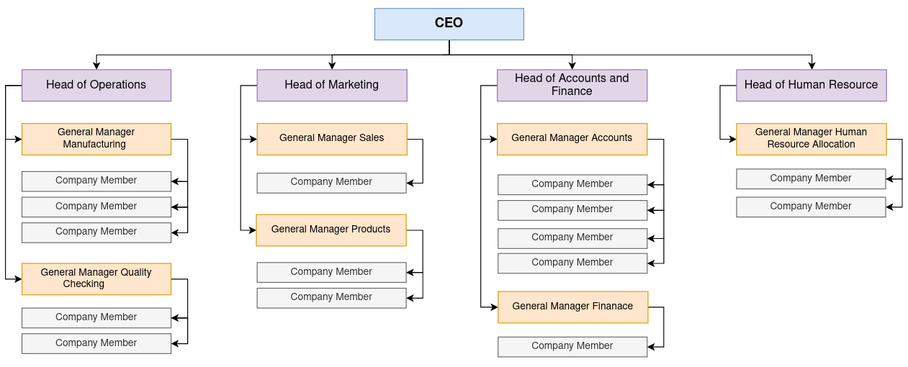

# JS Object Data Persistence via Spring Boot BackEnd 

This project demonstrates of saving entire **large js object** to a **relational database** via **spring boot** backend.
In here sample js object includes **all the details of a sample company profile**, and it is saved as a **one single record** 
to the **company_profile** database table. **company_profile** database table can be used to 
save any number of company details.

In the project, **company profiles web service** is exposed as an **API** under the **company profiles** resource and more information on the company profile web
service can be found in the below API documentation.

- [**Company Profiles API documentation**](https://documenter.getpostman.com/view/25306703/2s9Y5YS34g)

The sample company profile hierarchy is as follows,



The sample JS object that contains all the details of the sample company profile is as follows,

```javascript
company_profile_object = {
    "companyName": "ABC (Pvt) Ltd",
    "companyAddress": "Colombo 7, Sri Lanka",
    "establishedDate": "2023-01-01",
    "principleDepartment": {
        "departmentName": "Head of the company",
        "noOfEmployees": 1,
        "employeeDetails": [
            {
                "employeeId": 1,
                "employeeName": "Kasun De Silva",
                "employeeDesignation": "Chief Executive Officer",
                "responsibleDepartment": {
                    "departmentName": "Head of the company",
                    "noOfEmployees": 4,
                    "employeeDetails": [
                        {
                            "employeeId": 2,
                            "employeeName": "Nuwan Alwis",
                            "employeeDesignation": "Head of Operations Department",
                            "responsibleDepartment": {
                                "departmentName": "Operations Department",
                                "noOfEmployees": 2,
                                "employeeDetails": [
                                    {
                                        "employeeId": 6,
                                        "employeeName": "Prabhash Fernando",
                                        "employeeDesignation": "General Manager Manufacturing",
                                        "responsibleDepartment": {
                                            "departmentName": "Head of Manufacturing Department",
                                            "noOfEmployees": 3,
                                            "employeeDetails": [
                                                {
                                                    "employeeId": 13,
                                                    "employeeName": "Chethiya Silva",
                                                    "employeeDesignation": "Company Member",
                                                    "responsibleDepartment": null
                                                },
                                                {
                                                    "employeeId": 14,
                                                    "employeeName": "Subhash Perera",
                                                    "employeeDesignation": "Company Member",
                                                    "responsibleDepartment": null
                                                },
                                                {
                                                    "employeeId": 15,
                                                    "employeeName": "Kavindu Silva",
                                                    "employeeDesignation": "Company Member",
                                                    "responsibleDepartment": null
                                                }
                                            ]
                                        }
                                    },
                                    {
                                        "employeeId": 7,
                                        "employeeName": "Sahan Cooray",
                                        "employeeDesignation": "General Manager Quality Checking",
                                        "responsibleDepartment": {
                                            "departmentName": "Head of Quality Checking",
                                            "noOfEmployees": 2,
                                            "employeeDetails": [
                                                {
                                                    "employeeId": 16,
                                                    "employeeName": "Ajith Ranathunga",
                                                    "employeeDesignation": "Company Member",
                                                    "responsibleDepartment": null
                                                },
                                                {
                                                    "employeeId": 17,
                                                    "employeeName": "Sameera Wijethilaka",
                                                    "employeeDesignation": "Company Member",
                                                    "responsibleDepartment": null
                                                }
                                            ]
                                        }
                                    }
                                ]
                            }
                        },
                        {
                            "employeeId": 3,
                            "employeeName": "Ruwan Amarasinghe",
                            "employeeDesignation": "Head of Marketing Department",
                            "responsibleDepartment": {
                                "departmentName": "Marketing Department",
                                "noOfEmployees": 2,
                                "employeeDetails": [
                                    {
                                        "employeeId": 8,
                                        "employeeName": "Gehan Hettiarachchi",
                                        "employeeDesignation": "General Manager Sales",
                                        "responsibleDepartment": {
                                            "departmentName": "Head of Sales Department",
                                            "noOfEmployees": 1,
                                            "employeeDetails": [
                                                {
                                                    "employeeId": 18,
                                                    "employeeName": "Pubudu Silva",
                                                    "employeeDesignation": "Company Member",
                                                    "responsibleDepartment": null
                                                }
                                            ]
                                        }
                                    },
                                    {
                                        "employeeId": 9,
                                        "employeeName": "Ridmal De Silva",
                                        "employeeDesignation": "General Manager Products",
                                        "responsibleDepartment": {
                                            "departmentName": "Head of Products Department",
                                            "noOfEmployees": 2,
                                            "employeeDetails": [
                                                {
                                                    "employeeId": 19,
                                                    "employeeName": "Senura Perera",
                                                    "employeeDesignation": "Company Member",
                                                    "responsibleDepartment": null
                                                },
                                                {
                                                    "employeeId": 20,
                                                    "employeeName": "Bhathiya Fernando",
                                                    "employeeDesignation": "Company Member",
                                                    "responsibleDepartment": null
                                                }
                                            ]
                                        }
                                    }
                                ]
                            }
                        },
                        {
                            "employeeId": 4,
                            "employeeName": "Sampath Silva",
                            "employeeDesignation": "Head of Accounts and Finance",
                            "responsibleDepartment": {
                                "departmentName": "Accounts and Finanace Department",
                                "noOfEmployees": 2,
                                "employeeDetails": [
                                    {
                                        "employeeId": 10,
                                        "employeeName": "Lilan Senadeera",
                                        "employeeDesignation": "General Manager Accounts",
                                        "responsibleDepartment": {
                                            "departmentName": "Head of Accounts Department",
                                            "noOfEmployees": 4,
                                            "employeeDetails": [
                                                {
                                                    "employeeId": 21,
                                                    "employeeName": "Shan Perera",
                                                    "employeeDesignation": "Company Member",
                                                    "responsibleDepartment": null
                                                },
                                                {
                                                    "employeeId": 22,
                                                    "employeeName": "Kevin Fernando",
                                                    "employeeDesignation": "Company Member",
                                                    "responsibleDepartment": null
                                                },
                                                {
                                                    "employeeId": 23,
                                                    "employeeName": "Geshara Perera",
                                                    "employeeDesignation": "Company Member",
                                                    "responsibleDepartment": null
                                                },
                                                {
                                                    "employeeId": 24,
                                                    "employeeName": "Chamith Fernando",
                                                    "employeeDesignation": "Company Member",
                                                    "responsibleDepartment": null
                                                }
                                            ]
                                        }
                                    },
                                    {
                                        "employeeId": 11,
                                        "employeeName": "Sarith Guruge",
                                        "employeeDesignation": "General Manager Finance",
                                        "responsibleDepartment": {
                                            "departmentName": "Head of Finanace Department",
                                            "noOfEmployees": 1,
                                            "employeeDetails": [
                                                {
                                                    "employeeId": 25,
                                                    "employeeName": "Govindu Perera",
                                                    "employeeDesignation": "Company Member",
                                                    "responsibleDepartment": null
                                                }
                                            ]
                                        }
                                    }
                                ]
                            }
                        },
                        {
                            "employeeId": 5,
                            "employeeName": "Amal Silva",
                            "employeeDesignation": "Head of Human Resources",
                            "responsibleDepartment": {
                                "departmentName": "Human Resources Department",
                                "noOfEmployees": 1,
                                "employeeDetails": [
                                    {
                                        "employeeId": 12,
                                        "employeeName": "Suraj Attanayaka",
                                        "employeeDesignation": "General Manager Human Resouce Allocation",
                                        "responsibleDepartment": {
                                            "departmentName": "Head of Human Resouce Allocation Department",
                                            "noOfEmployees": 2,
                                            "employeeDetails": [
                                                {
                                                    "employeeId": 26,
                                                    "employeeName": "Geeshan Perera",
                                                    "employeeDesignation": "Company Member",
                                                    "responsibleDepartment": null
                                                },
                                                {
                                                    "employeeId": 27,
                                                    "employeeName": "Jude Silva",
                                                    "employeeDesignation": "Company Member",
                                                    "responsibleDepartment": null
                                                }
                                            ]
                                        }
                                    }
                                ]
                            }
                        }
                    ]
                }
            }
        ]
    }
}
```

## Used Technologies

- Java SE 11
- Spring Boot 2.7.8
- Apache Maven 3.8.6
- MySQL Community Server 8.0.31
- Added dependencies to pom.xml
    - spring-boot-starter-web 2.7.8
    - spring-boot-starter-data-jpa 2.7.8
    - spring-boot-starter-aop 2.7.8
    - spring-boot-starter-test 2.7.8
    - spring-boot-devtools
    - lombok 1.18.24
    - mysql-connector-j 8.0.31
    - modelmapper 3.1.0

#### Used Integrated Development Environment
- IntelliJ IDEA

## How to use ?
This project can be used by cloning the 
project to your local computer.

Make sure to create a **db** database in the MySQL community server.
If neglect to create, the project will automatically generate it when it is firstly executed.

#### Clone this repository
1. Clone the project using `https://github.com/PubuduJ/js-object-data-persist.git` terminal command.
2. Open the `pom.xml` file from **IntelliJ IDEA**, make sure to open this as a project.
3. Change the `spring.datasource.password` in the `application.properties` to your local machine MySQL server password.

## Version
v1.0.0

## License
Copyright &copy; 2023 [Pubudu Janith](https://www.linkedin.com/in/pubudujanith/). All Rights Reserved.<br>
This project is licensed under the [MIT license](LICENSE.txt).